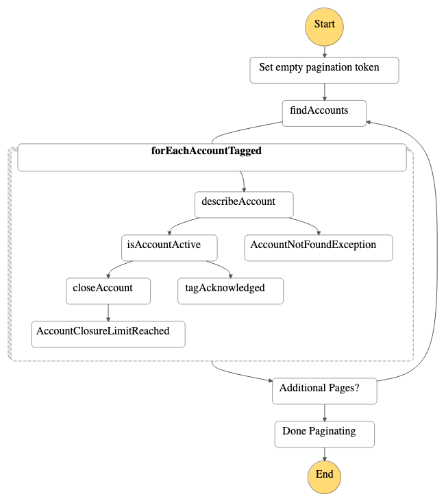
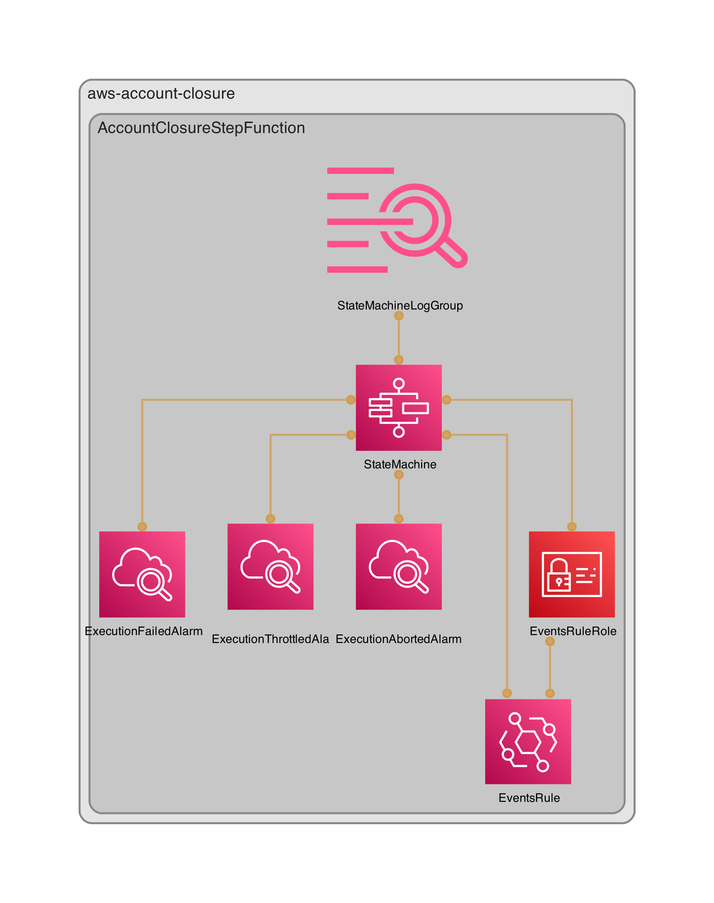

# AWS-Account-Closure

CDK construct and application for automating AWS account closure and dealing with the AWS close account quota which is dynamic.

>[!NOTE]
> You can close only 10% of member accounts, between 10 and 1000, within a rolling 30 day period. This quota is not bound by a calendar month, but starts when you close an account. After you reach this limit, you can't close additional accounts. For more information, see [Closing a member account in your organization](https://docs.aws.amazon.com/organizations/latest/userguide/orgs_manage_accounts_close.html) and [Quotas for AWS Organizations](https://docs.aws.amazon.com/organizations/latest/userguide/orgs_reference_limits.html) in the AWS Organizations User Guide.

>[!WARNING]
>
> - To reinstate a closed account, contact AWS Support within the 90-day grace period while the account is in SUSPENDED status.
>
> - If the AWS account you attempt to close is linked to an AWS GovCloud (US) account, the CloseAccount request will close both accounts. To learn important pre-closure details, see Closing an AWS GovCloud (US) account in the AWS GovCloud User Guide.

## Usage

Target accounts to be closed by adding a tag `organizations:account-closure` with a value of `REQUESTED`. The account closure step function will run once per day and attempt to delete any account with this tag until the account close limit is reached and retry each day until it succeeds and the tag value is changed to `ACKNOWLEDGED`

## Step Function Workflow

**Initialize Pagination:**
The workflow starts by setting an empty PaginationToken, preparing for paginated calls to retrieve resources.

**Find Tagged Accounts:**
It invokes the resourcegroupstaggingapi:getResources API to find AWS accounts tagged with organizations:account-closure:REQUESTED. This indicates accounts that are candidates for closure.

**Iterate Over Tagged Accounts:**
For each account retrieved, the workflow examines the account's details using the organizations:DescribeAccount API.

**Account Validation:**
The workflow checks the status of each account:

- If the account is active, the organizations:CloseAccount API is invoked to initiate the account closure process.
- If the account is not active, the workflow tags the account to acknowledge the closure request using organizations:TagResource. It adds tags two tags:
  - organizations:account-closure:ACKNOWLEDGED: Marks the request as processed.
  - organizations:account-closure:acknowledged-date: Timestamp of acknowledgment.

**Error Handling:**
Specific errors, such as Organizations.AccountNotFoundException and Organizations.ConstraintViolationException, are caught and handled gracefully to ensure smooth workflow execution:

- Account not found errors are treated as expected eventual consistency issues.
- Closure limit violations are logged and do not interrupt other operations.

**Paginate Results:**
If additional pages of tagged accounts exist, the workflow retrieves and processes them recursively by updating the PaginationToken. If there are no additional pages, the workflow ends.

**Completion:**
Once all accounts have been processed and no additional pages of results remain, the workflow concludes with a "Done Paginating" step.

## Infrastructure

